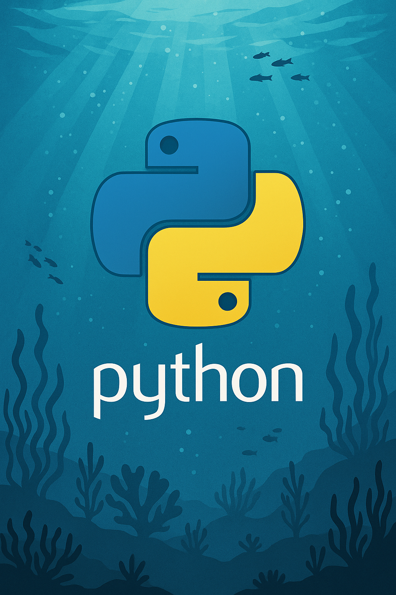
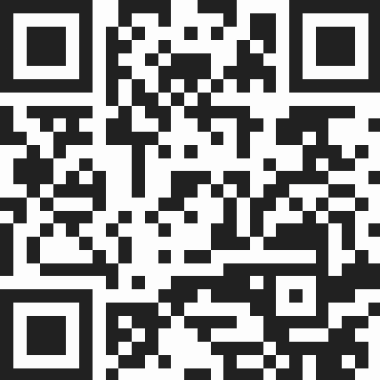
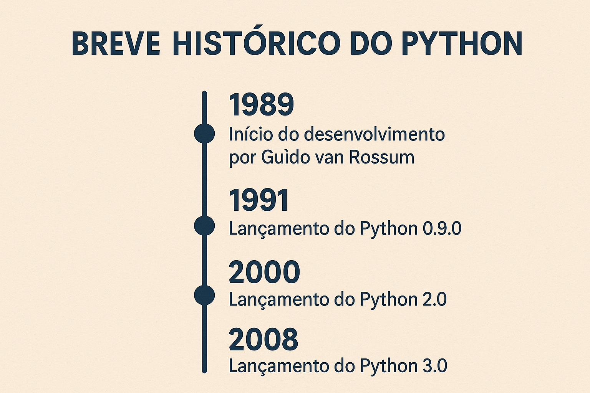
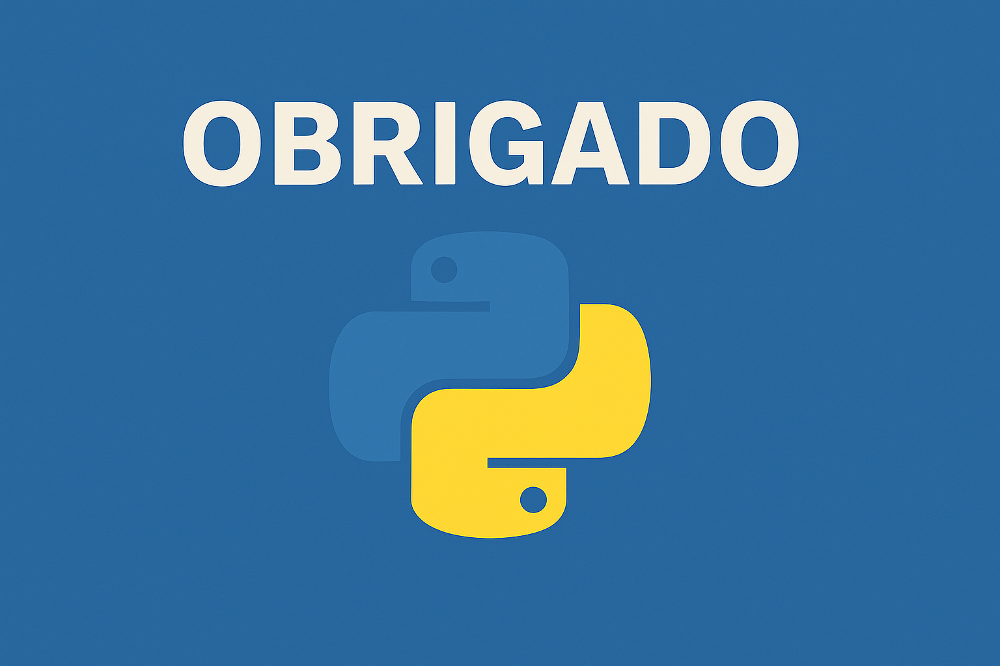

# Oceano do Python
por Edinei Cavalcanti

---

# Edinei Cavalcanti aka neiesc

Programador há mais de 15 anos, graduado em ciência da computação na UNIP de Rio Preto em 2015, focado em tecnologia e autoconhecimento, professor pelo Estado de São Paulo para o curso técnico em informática do novo ensino médio, um eterno aprendiz...

### Vamos conectar?
https://edinei.social
https://edinei.dev

---

# Vamos brincar?
https://partici.fi/43963606

---

---

# 🧘‍♂️ O Zen do Python, por Tim Peters

- ✨ Bonito é melhor que feio.
- 🔍 Explícito é melhor que implícito.
- 🧼 Simples é melhor que complexo.
- 🧩 Complexo é melhor que complicado.

---

# 🧘‍♂️ O Zen do Python, por Tim Peters

- 📄 Raso é melhor que profundo.
- 📏 Esparso é melhor que denso.
- 👀 Legibilidade conta.
- 🚫 Casos especiais não são especiais o bastante para quebrar as regras.

---

# 🧘‍♂️ O Zen do Python, por Tim Peters

- ⚖️ Embora a praticidade supere a pureza.
- ❌ Erros nunca devem passar silenciosamente.
- 🤫 A menos que sejam explicitamente silenciados.

---
# 🧘‍♂️ O Zen do Python, por Tim Peters

- ❓ Diante da ambiguidade, recuse a tentação de adivinhar.
- ☝️ Deve haver uma – e preferencialmente apenas uma – maneira óbvia de fazer isso.
- 🇳🇱 Embora essa maneira possa não ser óbvia à primeira vista, a menos que você seja holandês.

---

# 🧘‍♂️ O Zen do Python, por Tim Peters

- ⏰ Agora é melhor que nunca.
- 🧨 Embora nunca frequentemente seja melhor que agora mesmo.
- 🤯 Se a implementação é difícil de explicar, é uma má ideia.
- 💡 Se a implementação é fácil de explicar, pode ser uma boa ideia.
- 🧰 Namespaces são uma grande ideia – vamos fazer mais desses!

---

# 🐍 Características do Python

- 🧠 Sintaxe simples e legível – fácil de aprender e entender
- 🧱 Multi-paradigma – OO, funcional e procedural
- 🌀 Tipagem dinâmica e forte – flexível, mas segura
- ▶️ Interpretada – execução linha a linha, ideal para testes rápidos

---

# 🐍 Características do Python

- 📦 Biblioteca padrão + PyPI – milhares de pacotes prontos para uso
- 💻 Portável – roda em Windows, macOS, Linux, Raspberry Pi etc.
- 🌐 Comunidade ativa – fóruns, eventos e muita documentação
- 🚀 Versátil – web, dados, IA, automação, jogos e muito mais

---

